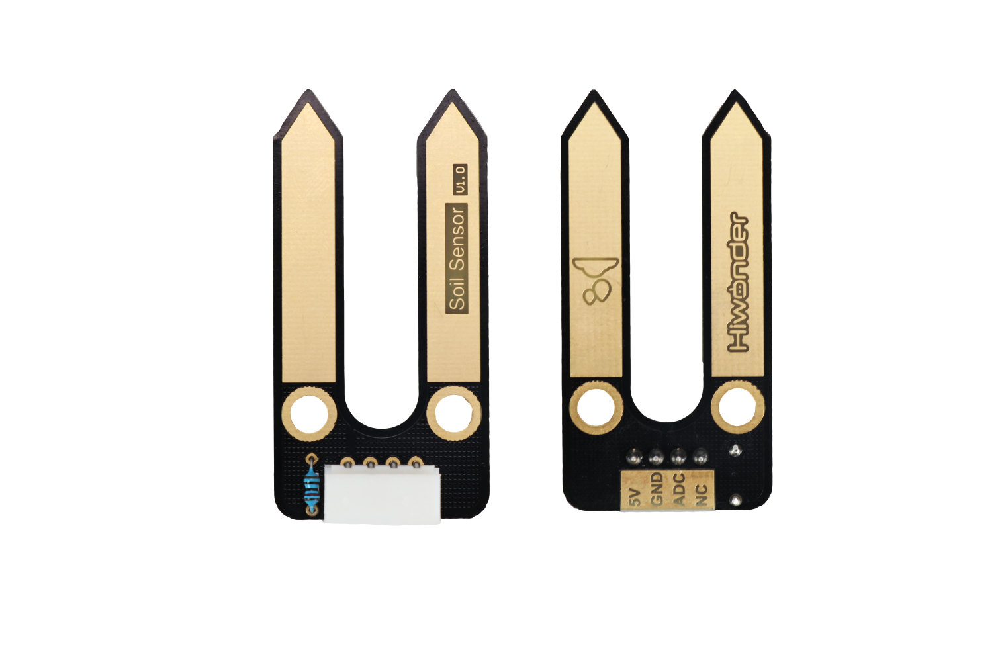
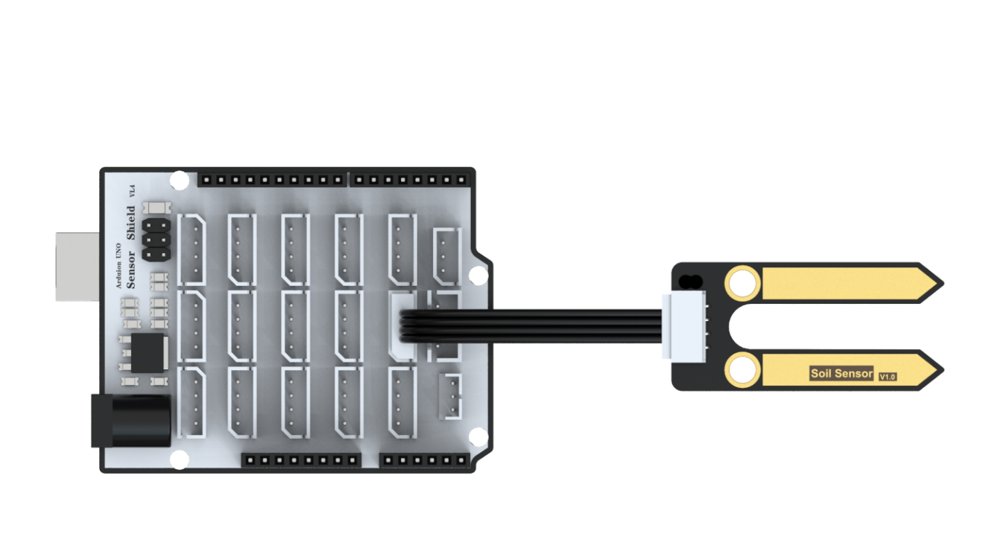
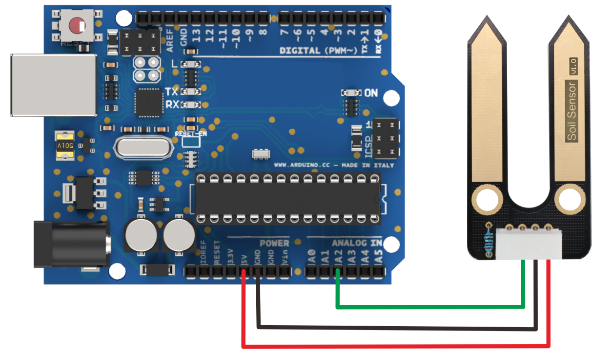
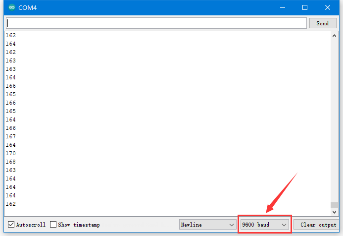

# 1. Soil Moisture Sensor



## 1.1 Product Introduction

Soil moisture sensor is used for detecting soil moisture and can output analog signal by converting the detected moisture. When in use, 5V GND terminal will input DC 5V voltage and ADC terminal will output voltage from 0 to 5V. The greater the soil moisture, the greater the output voltage of ADC terminal.

Use this sensor to cooperate with the water pump module and the water pipe to make a self-made automatic watering device, which can automatically water the small flowers when the soil is short of water. The surface of sensor is processed with immersion gold technology so that it can improve the ability to prevent corrosion in the soil and prolong its life.

## 1.2 Specification Instruction

### 1.2.1 Specification

<table class="docutils-nobg" border="1">
<colgroup>
<col style="width: 31%" />
<col style="width: 68%" />
</colgroup>
<tbody>
<tr>
<td style="text-align: center;">Working Voltage</td>
<td style="text-align: center;">DC 5V</td>
</tr>
<tr>
<td style="text-align: center;">Working Current</td>
<td style="text-align: center;">1mA</td>
</tr>
<tr>
<td rowspan="3" style="text-align: center;"><p>AD value</p>
<p>AD converter digit is 10-digit and reference voltage is 5V.</p></td>
<td style="text-align: center;">0~400：dry soil</td>
</tr>
<tr>
<td style="text-align: center;">400~800：moisture soil</td>
</tr>
<tr>
<td style="text-align: center;">800~950：into water</td>
</tr>
<tr>
<td style="text-align: center;">Port Type</td>
<td style="text-align: center;">5264-4AW</td>
</tr>
<tr>
<td style="text-align: center;">Size</td>
<td style="text-align: center;">48mm×24mm</td>
</tr>
<tr>
<td colspan="2" style="text-align: center;">Easy to install, compatible with Lego series</td>
</tr>
</tbody>
</table>

### 1.2.2 Port Instruction 

| Pin | Pin Instruction |
|:--:|:--:|
| 5V | Power Supply |
| GND | GND |
| ADC | ADC terminal outputs the detected soil moisture from 0~1023. The greater the soil moisture, the greater the value of ADC. |
| NC | empty |

## 1.3 Project

Using the sensor with Arduino UNO to help you get quick experience.

### 1.3.1 Preparation 

① Arduino UNO board \*1

② Expansion board compatible with Arduino UNO controller board \*1

③ Soil Moisture Sensor \*1

④ USB Cable \*1

⑤ 4PIN Wire \*1

### 1.3.2 Wiring diagram

Take connecting 4PIN wire to A2 and A3 port on Arduino expansion board as example.



Please note that if not using Arduino expansion board, you need to connect sensor to Arduino demo board through Dupont line as following.



### 1.3.3 Project Process

Step 1: Download and install Arduino IDE on your computer.

Step 2: Connect Arduino expansion board to the controller. Then connect soil moisture sensor to corresponding port on expansion board with 4PIN wire as the picture shown above.

Step 3: Connect Arduino UNO demo board to computer with USB cable. After opening Arduino IDE, please paste "**[1.3.5 Sample code](#anchor_1_3_5)**" in "**File/New**".

Step 4: Select suitable demo board and port to compile, then upload the program.

Step 5: After the code is uploaded successfully, please open the serial monitor to set the baud rate as 9600.

### 1.3.4 Project Outcome 

When insert soil sensor into flowerpot, the monitor will display simulated value of current soil moisture as picture shown below.



<p id="anchor_1_3_5"></p>

### 1.3.5 Example Code

```c++
/********Soil Moisture Sensor Testing Program*******
 * Arduino Type：Arduino UNO
 **************************/
#define Soil A2   //Connect soil moisture sensor to A2 port on the controller.
uint16_t humidity;

void setup()
{
  Serial.begin(9600);   //It is mainly used to print data during debugging.
  pinMode(Soil, INPUT);
}

void loop()
{
  humidity = analogRead(Soil);    //0-1023
  Serial.println(humidity);
}
```

## 1.4 Q&A

Q1：Why device manager failed to display data after uploading?

A：Please open the serial monitor to set the baud rate to 9600. The setting is consistent with that of the code.

Q2：Why soil sensor failed to display after uploading?

A：Please check the wiring. Signal terminal of the sensor need to be connected to A2 or A3 analog port of the controller. The setting is consistent with that of the code.